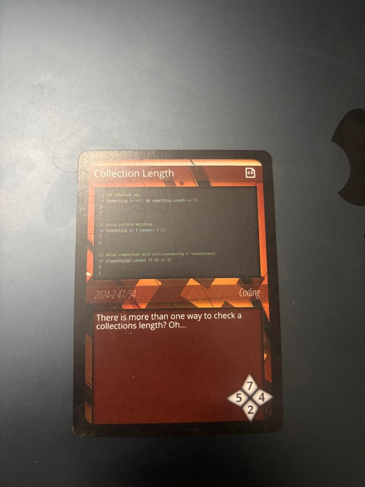

# #UNITY TIPS 016/100

## Cleaner Collection Length Checks with Pattern Matching



How many times have you written `if (list != null && list.Count > 0)` to safely check a collection's length? This null-then-length pattern is everywhere in Unity codebases, and while it works, it's verbose and error-prone. C# 9 introduced property patterns that let you express the same intent in a single, readable expression.

Pattern matching for collection length isn't just syntactic sugar—it changes how you think about null safety and conditional checks. Instead of procedural "check this, then check that" logic, you're declaring what shape of data you expect. The compiler handles the null check implicitly.

<br clear="left">

## The Problem

Checking collection length safely requires handling null references. The traditional approach leads to repetitive, verbose code:

```csharp
// Traditional null-safe length check
if (enemies != null && enemies.Length == 0)
{
    Debug.Log("No enemies remaining");
}

// Multiple conditions get unwieldy
if (players != null && players.Count >= 2 && players.Count <= 4)
{
    StartMultiplayerMatch();
}

// Nested collections are worse
if (inventory != null && inventory.Slots != null && inventory.Slots.Count > 0)
{
    DisplayInventory();
}
```

This pattern is tedious to write, easy to mess up, and clutters your logic with null checks.

## The Solution

Property patterns let you check for null and inspect properties in a single expression:

```csharp
// Pattern matching - null-safe and concise
if (enemies is { Length: 0 })
{
    Debug.Log("No enemies remaining");
}

// Check exact count
if (players is { Count: >= 2 and <= 4 })
{
    StartMultiplayerMatch();
}

// Works with any property, not just Length
if (inventory is { Slots.Count: > 0 })
{
    DisplayInventory();
}
```

## Syntax Breakdown

The property pattern `is { Length: 2 }` means:
1. The value is **not null**
2. Its `Length` property **equals 2**

You can use relational patterns for comparisons:

```csharp
// Exact match
if (items is { Count: 5 })

// Greater than
if (items is { Count: > 0 })

// Less than or equal
if (items is { Count: <= 10 })

// Range with 'and'
if (items is { Count: >= 1 and <= 100 })

// Combined with 'or'
if (items is { Count: 0 or > 100 })
```

## Practical Examples

### 1. Empty Collection Checks

```csharp
public class WaveManager : MonoBehaviour
{
    private List<Enemy> _activeEnemies = new();

    void Update()
    {
        // Clean and readable
        if (_activeEnemies is { Count: 0 })
        {
            StartNextWave();
        }
    }

    // Negation pattern for "has items"
    public bool HasActiveEnemies() => _activeEnemies is { Count: > 0 };
}
```

### 2. Validating Input Arrays

```csharp
public class SpawnSystem : MonoBehaviour
{
    public void SpawnEnemies(Transform[] spawnPoints)
    {
        // Validate input in one expression
        if (spawnPoints is not { Length: > 0 })
        {
            Debug.LogWarning("No spawn points provided");
            return;
        }

        foreach (var point in spawnPoints)
        {
            Instantiate(_enemyPrefab, point.position, point.rotation);
        }
    }
}
```

### 3. Multiplayer Lobby Validation

```csharp
public class LobbyController : MonoBehaviour
{
    private List<Player> _connectedPlayers;

    public bool CanStartGame()
    {
        // 2-4 players required
        return _connectedPlayers is { Count: >= 2 and <= 4 };
    }

    public string GetLobbyStatus()
    {
        return _connectedPlayers switch
        {
            null => "Lobby not initialized",
            { Count: 0 } => "Waiting for players...",
            { Count: 1 } => "Need at least one more player",
            { Count: >= 2 and <= 4 } => "Ready to start!",
            { Count: > 4 } => "Too many players"
        };
    }
}
```

### 4. Inventory System

```csharp
public class Inventory : MonoBehaviour
{
    private ItemStack[] _slots;

    public bool IsFull => _slots is { Length: > 0 } &&
                          System.Array.TrueForAll(_slots, s => s != null);

    public bool IsEmpty => _slots is not { Length: > 0 } ||
                           System.Array.TrueForAll(_slots, s => s == null);

    public bool TryAddItem(Item item)
    {
        if (_slots is not { Length: > 0 })
            return false;

        for (int i = 0; i < _slots.Length; i++)
        {
            if (_slots[i] == null)
            {
                _slots[i] = new ItemStack(item);
                return true;
            }
        }
        return false;
    }
}
```

### 5. Dialogue System with Response Validation

```csharp
public class DialogueManager : MonoBehaviour
{
    public void DisplayDialogue(DialogueNode node)
    {
        if (node is not { Text.Length: > 0 })
        {
            Debug.LogError("Invalid dialogue node");
            return;
        }

        _dialogueText.text = node.Text;

        // Different UI based on response count
        switch (node.Responses)
        {
            case { Length: 0 }:
                ShowContinueButton();
                break;
            case { Length: 1 }:
                ShowSingleResponse(node.Responses[0]);
                break;
            case { Length: 2 or 3 }:
                ShowResponseButtons(node.Responses);
                break;
            case { Length: > 3 }:
                ShowScrollableResponses(node.Responses);
                break;
        }
    }
}
```

### 6. Audio Manager with Clip Validation

```csharp
public class AudioManager : MonoBehaviour
{
    [SerializeField] private AudioClip[] _musicTracks;
    [SerializeField] private AudioClip[] _sfxClips;

    public void PlayRandomMusic()
    {
        if (_musicTracks is not { Length: > 0 })
        {
            Debug.LogWarning("No music tracks assigned");
            return;
        }

        int index = Random.Range(0, _musicTracks.Length);
        _musicSource.clip = _musicTracks[index];
        _musicSource.Play();
    }

    public void PlaySFX(int index)
    {
        // Validate array and index in pattern
        if (_sfxClips is { Length: var len } && index >= 0 && index < len)
        {
            _sfxSource.PlayOneShot(_sfxClips[index]);
        }
    }
}
```

### 7. Combining with Other Patterns

```csharp
public class QuestSystem : MonoBehaviour
{
    public void CheckQuestCompletion(Quest quest)
    {
        // Combine property patterns with type patterns
        var status = quest switch
        {
            null => "Invalid quest",
            { Objectives: null or { Count: 0 } } => "Quest has no objectives",
            { IsCompleted: true } => "Quest already completed",
            { Objectives: { Count: var total }, CompletedCount: var done }
                when done >= total => "Quest complete!",
            { Objectives: { Count: var total }, CompletedCount: var done }
                => $"Progress: {done}/{total}"
        };

        Debug.Log(status);
    }
}
```

## Comparison of Approaches

```csharp
// ❌ Traditional - verbose and repetitive
if (items != null && items.Length == 2)
{
    // ...
}

// ❌ Null-conditional with null-coalescing - obscures intent
if ((items?.Length ?? 0) == 2)
{
    // ...
}

// ✅ Pattern matching - clear and concise
if (items is { Length: 2 })
{
    // ...
}
```

| Approach | Null-Safe | Readable | Concise |
|----------|-----------|----------|---------|
| `x != null && x.Length == n` | Yes | Moderate | No |
| `(x?.Length ?? 0) == n` | Yes | Low | Yes |
| `x is { Length: n }` | Yes | High | Yes |

## Best Practices

1. **Use property patterns for null-safe checks** - They're more readable than `&&` chains or null-coalescing operators.

2. **Prefer `is { Count: 0 }` over `is { Count: < 1 }`** - Be explicit about checking for empty collections.

3. **Use `is not` for negation** - `if (list is not { Count: > 0 })` reads better than complex boolean logic.

4. **Combine with switch expressions** - Property patterns shine in switch expressions for multi-branch logic.

5. **Don't overuse nested patterns** - `{ Foo.Bar.Baz: 1 }` can become hard to read. Sometimes intermediate variables are clearer.

6. **Remember it checks for null implicitly** - `is { Length: > 0 }` means non-null AND has items.

7. **Works with any property** - Not limited to `Length` or `Count`. Any property can be pattern matched.

## Common Patterns

```csharp
// Check if collection has items
if (list is { Count: > 0 })

// Check if collection is empty or null
if (list is not { Count: > 0 })

// Check for exact count
if (array is { Length: 3 })

// Check range
if (players is { Count: >= 2 and <= 8 })

// Check in switch
return inventory switch
{
    { Count: 0 } => "Empty",
    { Count: < 10 } => "Light",
    { Count: < 50 } => "Moderate",
    _ => "Heavy"
};
```

## Technical Notes

- Property patterns require C# 8.0+ (Unity 2020.2+)
- Relational patterns (`>`, `<`, `>=`, `<=`) require C# 9.0+ (Unity 2021.2+)
- Combined patterns with `and`/`or` require C# 9.0+
- No performance overhead compared to traditional null checks—the compiler generates equivalent IL

## Conclusion

Property patterns transform verbose null-and-length checks into declarative statements. When you write `items is { Count: > 0 }`, you're not just checking two conditions—you're expressing that you expect a non-null collection with items. This clarity makes your code easier to read, review, and maintain.

The pattern matching approach forces you to think about what you're actually checking for, rather than mechanically writing null guards. It's a small syntax change that meaningfully improves how you express intent in your code.

---

*Credits to Binary Impact GmbH for the developer card inspiring this write-up.*
